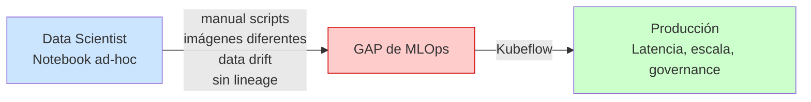
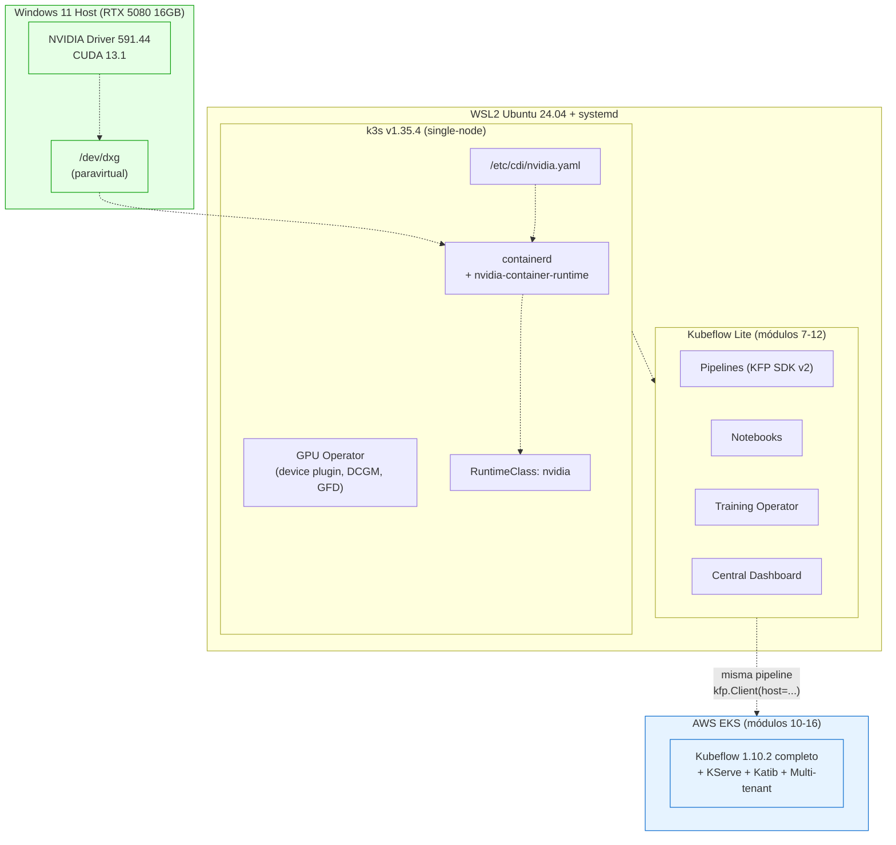
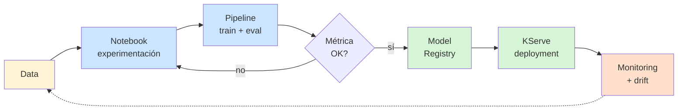

# Kubeflow MLOps Lab — On-Premise

[](https://k3s.io)
[](https://kubeflow.org)
[](https://github.com/NVIDIA/gpu-operator)
[](https://pytorch.org)
[](LICENSE)

> Lab de referencia para curso **MLOps con Kubeflow on-premise**.
> Asumimos conocimiento previo de ML/DL — el foco es **operacionalizar modelos en producción**:
> reproducibilidad, multi-tenancy, GPU sharing, CI/CD, deployment, observability.

---

## ¿Qué problema resuelve este curso?



El **gap** entre un notebook que "funciona en mi máquina" y un servicio de inferencia
que aguanta 10k req/s con SLOs es **MLOps**. Kubeflow es la implementación
**Kubernetes-native** de ese pipeline completo.

## Stack del lab



## ¿Qué cubre este lab?

| Capa MLOps | Componente Kubeflow | En este repo |
|---|---|---|
| **Compute** (Kubernetes + GPU) | k3s + GPU Operator | ✅ scripts/ + manifests/ |
| **Pipeline orchestration** | Kubeflow Pipelines (KFP) | ✅ models/03_kfp_pipeline.py |
| **Notebooks multi-tenant** | JupyterHub / Notebook Controller | ⏭ módulo 5 (EKS) |
| **Hyperparameter tuning** | Katib | ⏭ módulo 8 (EKS) |
| **Distributed training** | Training Operator (PyTorchJob, TFJob) | ⏭ módulo 9 (EKS) |
| **Model serving** | KServe | ⏭ módulo 10 (EKS) |
| **Lineage & metadata** | ML Metadata Store | ⏭ con KFP |
| **CI/CD declarativo** | Argo CD + Argo Workflows | ⏭ módulo 12 |
| **Observability** | DCGM exporter + Prometheus | ⏭ módulo 11 |

## Ciclo MLOps que enseñamos



Este es el ciclo **completo** del curso. Cada flecha es un módulo.

## Quickstart

**Pre-requisitos:** WSL2 con Ubuntu 24.04, Docker Desktop, NVIDIA driver Windows ≥ 580.

```bash
# 1. Bootstrap del cluster local
sudo bash scripts/01-setup-user-systemd.sh
bash scripts/02-install-runtimes.sh
bash scripts/03-nvidia-toolkit.sh
bash scripts/04-cdi-wsl.sh
bash scripts/05-install-k3s.sh
bash scripts/06-gpu-operator.sh

# 2. Validar GPU passthrough en pod
kubectl apply -f manifests/gpu-test-pod.yaml
kubectl logs gpu-test
# → nvidia-smi mostrando RTX 5080 dentro del container

# 3. Demos del curso (ya con resultados validados)
cd models
uv venv && source .venv/bin/activate
uv pip install -r requirements.txt
python -m ensurepip   # KFP local lo necesita
python 03_kfp_pipeline.py   # ML clásico + DL + KFP DAG en uno
```

Ver [`docs/01-getting-started.md`](docs/01-getting-started.md) para el tutorial completo.

## Resultados validados (2026-05-05)

| Componente | Métrica | Tiempo |
|---|---|---|
| GBC (sklearn, CPU) | accuracy 0.9556 | 0.24 s |
| LeNet-5 (PyTorch + RTX 5080) | accuracy 0.9860 | 11.7 s (cold) / 4.7 s (warm) |
| Pipeline KFP (3 componentes en DAG) | status SUCCESS | ~5 s overhead |

Detalle en [`docs/results-2026-05-05.md`](docs/results-2026-05-05.md).

## Documentación

| Archivo | Para qué |
|---|---|
| [`00-curso-outline.md`](docs/00-curso-outline.md) | 16 módulos del curso, qué se enseña dónde |
| [`01-getting-started.md`](docs/01-getting-started.md) | Tutorial paso a paso, ~30 min al primer pipeline |
| [`02-mlops-with-kubeflow.md`](docs/02-mlops-with-kubeflow.md) | Qué es MLOps, ciclo de vida, dónde encaja Kubeflow |
| [`03-architecture.md`](docs/03-architecture.md) | Stack vertical, flujo de petición GPU |
| [`04-pipeline-patterns.md`](docs/04-pipeline-patterns.md) | 5 patrones MLOps reales con código |
| [`05-comparison.md`](docs/05-comparison.md) | Kubeflow vs SageMaker MLOps / Vertex AI / MLflow+Airflow |
| [`06-glossary.md`](docs/06-glossary.md) | Términos clave del ecosistema |
| [`findings.md`](docs/findings.md) | Hallazgos: gcr.io deprecation, mount-rshared, CDI WSL |
| [`results-2026-05-05.md`](docs/results-2026-05-05.md) | Resultados del lab con números reales |

## Estructura del repo

```
.
├── README.md                    ← este archivo
├── LICENSE                      ← MIT
├── scripts/                     ← bootstrap del cluster (7 archivos)
├── manifests/                   ← YAML de Kubernetes
├── models/                      ← demos del curso (GBC + CNN + KFP pipeline)
├── docs/                        ← documentación pedagógica (9 archivos)
└── memory/                      ← snapshot del estado del proyecto
```

## Asumimos que ya sabes

Este lab es para audiencia **MLOps / Platform / DevOps**. No enseñamos:
- Cómo funciona gradient descent o backpropagation
- Cómo elegir hiperparámetros desde principios
- Estadística inferencial

Sí enseñamos:
- Cómo empaquetar tu modelo como componente reproducible
- Cómo orquestar entrenamientos en Kubernetes
- Cómo servir el modelo con autoscaling
- Cómo monitorear drift y latencia
- Cómo hacer CI/CD declarativo de pipelines ML

Si necesitas el repaso de ML, lee [docs/02-mlops-with-kubeflow.md → "ML refresher en 2 minutos"](docs/02-mlops-with-kubeflow.md#ml-refresher-en-2-minutos).
