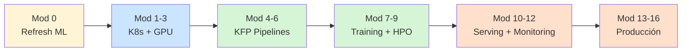

# Outline del curso — MLOps con Kubeflow on-premise

Audiencia objetivo: **Platform/DevOps engineers**, **MLOps engineers**,
**Data Scientists** que quieren llevar modelos a producción.

Pre-requisito: nociones básicas de ML (entrenamiento, evaluación, métricas).
**No enseñamos teoría ML** — asumimos conocimiento o repaso breve.

## Estructura

## Módulos

### Módulo 0 — Refresh ML (1 hora)

Solo si el grupo lo pide. Cubre:
- Lifecycle: train → eval → deploy → monitor
- Métricas básicas (accuracy, F1, MSE)
- Diferencia ML clásico vs Deep Learning
- Por qué necesitamos GPU para DL

### Módulos 1-3 — Kubernetes + GPU (4 horas) — **LOCAL**

| Mod | Tema | Lab |
|---|---|---|
| 1 | Kubernetes refresher: pods, deployments, services, RBAC | k3s en WSL2 |
| 2 | Storage + Networking + Ingress | Longhorn + MetalLB local |
| 3 | **GPU en K8s**: NVIDIA Container Toolkit, GPU Operator, RuntimeClass, CDI | RTX 5080 passthrough a pods |

### Módulos 4-6 — Kubeflow Pipelines (4 horas) — **LOCAL + EKS**

| Mod | Tema | Lab |
|---|---|---|
| 4 | KFP SDK v2: components, pipelines, artifacts, lineage | `kfp.local` |
| 5 | Notebooks multi-tenant + Profiles | JupyterHub on EKS |
| 6 | CI/CD: pipelines como código + Argo CD | GitOps lab |

### Módulos 7-9 — Training + HPO (3 horas) — **EKS**

| Mod | Tema | Lab |
|---|---|---|
| 7 | Training Operator: PyTorchJob distribuido | 2× g5.12xlarge spot |
| 8 | Katib: hyperparameter tuning Bayesian | Optimizar LeNet sobre MNIST |
| 9 | Spark Operator: feature engineering escalable | Dataset tabular grande |

### Módulos 10-12 — Serving + Observability (3 horas) — **EKS**

| Mod | Tema | Lab |
|---|---|---|
| 10 | KServe: inference + autoscale + canary + A/B | Deploy LeNet con HTTP endpoint |
| 11 | DCGM exporter + Prometheus + Grafana | Dashboards GPU + latencia |
| 12 | Drift detection + Alibi | Detector de drift en producción |

### Módulos 13-16 — Producción (4 horas)

| Mod | Tema | Lab |
|---|---|---|
| 13 | **Image registry on-prem**: Harbor + skopeo mirroring | Air-gapped deploy |
| 14 | **Auth**: Dex + Keycloak / Cognito OIDC | Multi-tenancy real |
| 15 | Disaster recovery: etcd backups, model registry redundancy | Restore drill |
| 16 | Cost optimization: spot, MIG, time-slicing, GPU pooling | Métricas de utilización |

## Total: ~20 horas, 5 sesiones de 4 horas

## Material que entregas a alumnos

- Acceso al repo `github.com/JazzzFM/kubeflow-onprem-lab`
- Slides de cada módulo (en preparación)
- 5 ejemplos de pipelines en `examples/` (en preparación)
- Checklist de "production-readiness MLOps"
- Acceso a EKS de prácticas (vía AWS credits)
