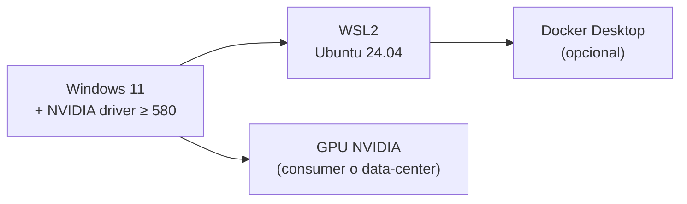
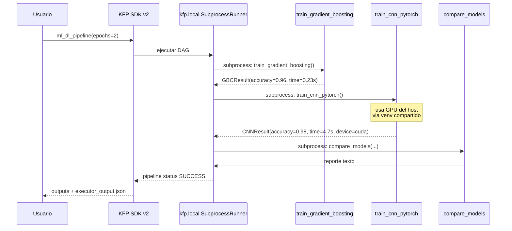

# Getting started — del cero a tu primer pipeline KFP

> **Objetivo:** que tras 30 minutos tengas un cluster Kubernetes con GPU
> y un pipeline de Kubeflow corriendo en él. **Sin teoría ML**, todo MLOps.

## Pre-requisitos



| Item | Versión mínima |
|---|---|
| Windows 11 build | 22H2+ |
| WSL | 2.0+ (`wsl --version`) |
| NVIDIA driver Windows | 580 |
| Espacio disco libre (C:) | 50 GB |
| RAM | 16 GB (32+ recomendado) |

## Paso 1 — Validar GPU desde WSL

```bash
nvidia-smi
```

Debes ver tu GPU. Si no aparece, actualiza el driver de NVIDIA en Windows
(no instales drivers Linux dentro de WSL).

## Paso 2 — Bootstrap del cluster (7 scripts, ~10 min)

```bash
git clone https://github.com/JazzzFM/kubeflow-onprem-lab.git
cd kubeflow-onprem-lab
sudo bash scripts/01-setup-user-systemd.sh
bash scripts/02-install-runtimes.sh         # Node, Python, gh, kubectl, helm
bash scripts/03-nvidia-toolkit.sh           # NVIDIA Container Toolkit
bash scripts/04-cdi-wsl.sh                  # CDI spec mode=wsl
bash scripts/05-install-k3s.sh              # k3s + nvidia runtime auto-detect
bash scripts/06-gpu-operator.sh             # GPU Operator vía Helm
bash scripts/07-fix-mount-rshared.sh        # fix WSL2 mount propagation
```

Validación intermedia:

```mermaid
flowchart LR
    A[bash scripts] --> B{kubectl get nodes}
    B -->|"NotReady"| FAIL[ver findings.md]
    B -->|"Ready"| C{kubectl get node -o jsonpath='{.items[0].status.allocatable.nvidia\.com/gpu}'}
    C -->|"0"| FAIL
    C -->|"1"| OK[GPU registrada ✓]

    style OK fill:#d6f5d6
    style FAIL fill:#ffcccc
```

## Paso 3 — Pod de prueba con GPU

```bash
kubectl apply -f manifests/gpu-test-pod.yaml
kubectl wait --for=condition=Ready pod/gpu-test --timeout=120s
kubectl logs gpu-test
```

Output esperado:

```
+-----------------------------------------------------------------------------------------+
| NVIDIA-SMI 590.44.01              Driver Version: 591.44         CUDA Version: 13.1     |
| GPU 0: NVIDIA GeForce RTX 5080 ... 16303MiB                                             |
+-----------------------------------------------------------------------------------------+
```

Si lo ves, **tu cluster ya pasa GPU a containers**. Esto es el "hello world"
de MLOps en Kubernetes.

## Paso 4 — Primer pipeline Kubeflow

```bash
cd models
uv venv --python 3.12
source .venv/bin/activate
uv pip install -r requirements.txt
python -m ensurepip --default-pip   # KFP local necesita pip dentro del venv
python 03_kfp_pipeline.py
```

Lo que pasa internamente:



## Paso 5 — ¿Qué viene?

| Quieres... | Lee |
|---|---|
| Entender qué es MLOps y por qué Kubeflow | [`02-mlops-with-kubeflow.md`](02-mlops-with-kubeflow.md) |
| Ver patrones de pipelines reales (retraining, batch, etc.) | [`04-pipeline-patterns.md`](04-pipeline-patterns.md) |
| Comparar Kubeflow vs SageMaker / Vertex AI | [`05-comparison.md`](05-comparison.md) |
| Términos del ecosistema | [`06-glossary.md`](06-glossary.md) |
| Bootstrap de Kubeflow completo (no Lite) | sección "Módulo 4-6" del [outline](00-curso-outline.md) |

## Troubleshooting rápido

| Síntoma | Probable causa | Fix |
|---|---|---|
| `nvidia-smi` falla en WSL | Driver Windows desactualizado | Update GeForce/Studio driver |
| Pod GPU en `Pending` | scheduler ve memoria saturada | `kubectl describe node` y reducir requests |
| `kubectl logs` falla con "pod does not exist" | kubelet/etcd desync (común WSL) | `kubectl delete pod --force --grace-period=0` |
| `failed calling webhook ...` | webhook pod fantasma | Mismo: force delete del webhook pod |
| Pipeline KFP local: "No module named pip" | venv sin pip | `python -m ensurepip` |

Más en [`findings.md`](findings.md).
