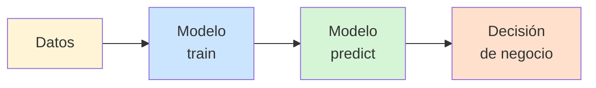
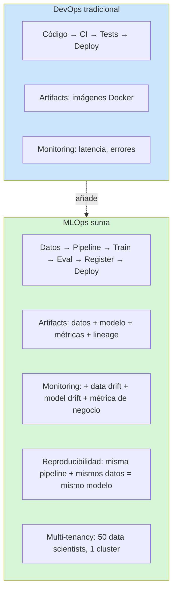
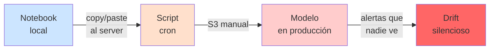
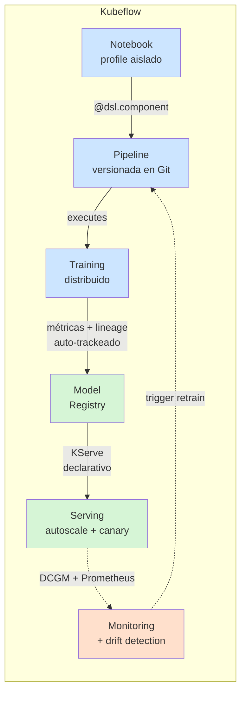
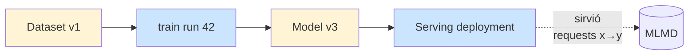
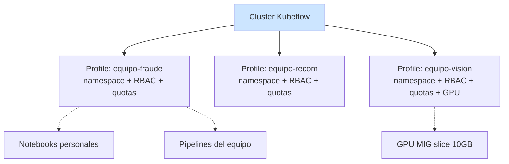
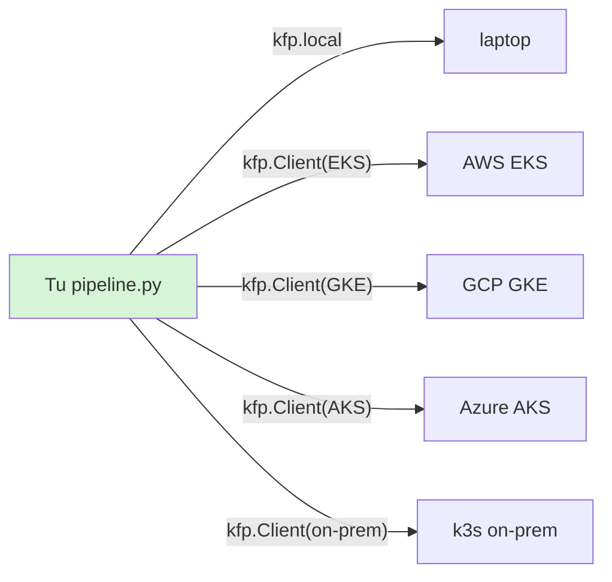

# MLOps con Kubeflow

Este documento explica **qué es MLOps**, qué problemas resuelve, y por qué
Kubeflow es la implementación Kubernetes-native de referencia. **No teoría ML**.

## ML refresher en 2 minutos

Para los que vienen de DevOps/Platform sin background ML:



- **Train** = aprender de datos históricos (proceso pesado, GPU, horas/días)
- **Inference (predict)** = usar el modelo aprendido para nuevas predicciones (rápido, ms)
- **Métricas** = números que miden qué tan bueno es (accuracy, F1, RMSE, etc.)
- **Drift** = los datos cambian con el tiempo, el modelo deja de servir → reentrenar

Eso es todo lo que necesitas para empezar el curso.

## ¿Qué es MLOps?

**MLOps = DevOps aplicado a sistemas de Machine Learning.** Pero ML tiene
características que DevOps tradicional no maneja bien:



## El gap que resuelve Kubeflow

Sin Kubeflow, el flujo típico de una empresa con ML:



Problemas:
- **Reproducibilidad**: ¿qué versión de datos? ¿qué semilla random?
- **Lineage**: ¿este modelo sirvió cuál cliente? ¿qué dataset entrenó?
- **Multi-tenancy**: 10 data scientists pisándose la GPU
- **Deployment**: ¿cómo escalo? ¿cómo hago canary?
- **Drift**: ¿el modelo sigue siendo bueno? ¿cuándo reentreno?

Con Kubeflow:



## Las 7 ventajas que enseñamos en el curso

### 1. Reproducibilidad por contrato

Cada componente declara sus inputs/outputs como tipos:

```python
@dsl.component
def train(
    dataset: Input[Dataset],     # input artifact
    epochs: int = 10,             # parámetro
) -> NamedTuple("Result", [
    ("model", Output[Model]),     # output artifact
    ("accuracy", float),          # métrica
]): ...
```

Esto es **un contrato versionable en Git**. Mismo input → mismo output.

### 2. Lineage automático con ML Metadata



Sin escribir código de tracking, ML Metadata Store registra:
- De qué dataset salió este modelo
- Quién lo entrenó (qué pipeline run)
- Qué versiones de imagen se usaron
- Qué requests sirvió en producción

Equivalente con MLflow puro requiere instrumentación manual.

### 3. Multi-tenancy con Profiles



50 data scientists, 1 cluster, aislados. Sin Kubeflow tendrías 50 EKS o
1 caos compartido.

### 4. GPU sharing

GPUs caras → necesitas compartirlas. Kubeflow + GPU Operator soporta:

| Estrategia | Cuándo | Compatible con |
|---|---|---|
| **MIG** (Multi-Instance GPU) | Producción, 1 GPU → 7 slices | A100, H100, A30 |
| **Time-slicing** | Dev, varias replicas comparten 1 GPU | Cualquier GPU |
| **GPU exclusive** | Training pesado | Default, 1 pod = 1 GPU |

Tu lab con RTX 5080 (sin MIG) usa time-slicing para múltiples notebooks.

### 5. KServe — serving production-grade

Sin Kubeflow:
```bash
# Tu colega: "deployar el modelo"
docker build → push registry → write deploy.yaml →
write service.yaml → write hpa.yaml → write ingress.yaml →
write monitoring → escalar manual
```

Con KServe:
```yaml
apiVersion: serving.kserve.io/v1beta1
kind: InferenceService
metadata:
  name: lenet-mnist
spec:
  predictor:
    pytorch:
      storageUri: s3://models/lenet-v3
    minReplicas: 1
    maxReplicas: 100
    canaryTrafficPercent: 10
```

Eso es todo. KServe maneja: autoscale (scale-to-zero), canary, A/B,
HTTP+gRPC endpoint, batching, transformers pre/post.

### 6. Pipelines portables entre clouds y on-prem



**Mismo código** en todos. Esto es lo que SageMaker / Vertex AI **no te dan**:
no hay lock-in.

### 7. Estándares abiertos

- **KFP DSL v2** = estándar de facto (Vertex AI Pipelines lo adoptó como SDK)
- **KServe** = sucesor de SageMaker Endpoints / Vertex Predictions
- **ML Metadata Store** = lineage portable entre orquestadores

## ¿Cuándo NO usar Kubeflow?

Honestidad para el curso:

| Situación | Mejor alternativa |
|---|---|
| Equipo de 2 personas, sin K8s | MLflow + Airflow + scripts |
| Solo serving (no training pipelines) | BentoML, Triton, vLLM standalone |
| 100% AWS, sin plan multi-cloud | SageMaker Pipelines (más rápido onboarding) |
| Equipo sin DevOps culture | Databricks ML / Vertex AI managed |

**Kubeflow brilla cuando**: 10+ personas, K8s ya en uso, multi-cloud o on-prem,
o requirement de soberanía de datos.

## Lectura recomendada

- [Designing MLOps Systems](https://www.oreilly.com/library/view/designing-machine-learning/9781098115777/) — Chip Huyen
- [ML Engineering for Production](https://www.coursera.org/specializations/machine-learning-engineering-for-production-mlops) — Andrew Ng
- [Kubeflow.org docs](https://www.kubeflow.org/)
- [KFP SDK v2 reference](https://kubeflow-pipelines.readthedocs.io/en/latest/)
