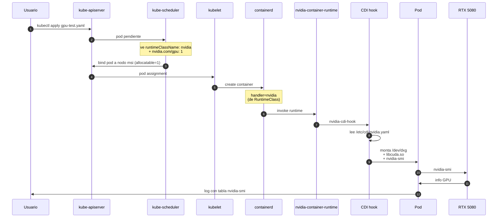
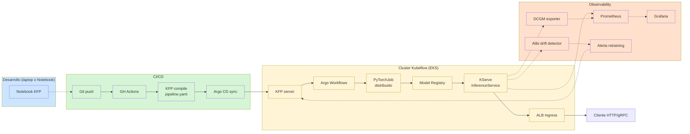

# Arquitectura del lab

## Stack vertical (de hardware a workload)

```mermaid
flowchart TB
    subgraph HW["Hardware"]
        CPU["Intel Core Ultra 9 275HX<br/>24 cores, 0 SMT"]
        RAM["16 GB DDR5-5600<br/>(ampliable a 96 GB)"]
        GPU["NVIDIA RTX 5080 Laptop<br/>Blackwell, 16 GB VRAM"]
        SSD["NVMe Micron 2500<br/>954 GB"]
    end

    subgraph WIN["Windows 11 Host"]
        DRV["NVIDIA Driver 591.44<br/>CUDA 13.1"]
        WSL["WSL 2.5.10<br/>Hyper-V virtual switch"]
    end

    subgraph G["WSL2 Guest (Ubuntu 24.04)"]
        K["Kernel 6.6.87 microsoft-WSL2"]
        SD["systemd PID 1<br/>via /etc/wsl.conf"]
        MOUNT["mount --make-rshared /<br/>(boot command)"]
    end

    subgraph K3["k3s v1.35.4 (single-node)"]
        SVR["k3s server"]
        CTR["containerd embedded<br/>+ nvidia-container-runtime"]
        ETCD["etcd embedded (kine sqlite)"]
        FLAN["flannel CNI (default)"]
    end

    subgraph NV["NVIDIA en cluster"]
        TK["nvidia-container-toolkit 1.19.0"]
        CDI["/etc/cdi/nvidia.yaml<br/>(mode=wsl)"]
        GO["GPU Operator (Helm)"]
        DP["nvidia-device-plugin"]
        DCGM["nvidia-dcgm-exporter"]
        GFD["gpu-feature-discovery"]
    end

    subgraph WL["Workload"]
        POD["Pod gpu-test<br/>runtimeClassName: nvidia<br/>nvidia.com/gpu: 1"]
    end

    HW --> WIN
    WIN -.->|"/dev/dxg paravirtual"| G
    G --> K3
    K3 --> NV
    NV --> WL

    classDef hw fill:#fff5d6
    classDef host fill:#cce5ff
    classDef cluster fill:#d6f5d6
    classDef gpu fill:#e6ffe6
    class HW,CPU,RAM,GPU,SSD hw
    class WIN,DRV,WSL host
    class K3,SVR,CTR,ETCD,FLAN cluster
    class NV,TK,CDI,GO,DP,DCGM,GFD gpu
```

## Flujo de una petición de GPU

## Por qué cada capa importa

| Capa | Razón pedagógica |
|---|---|
| **WSL2** | Demuestra que GPU passthrough en WSL es diferente al bare-metal (DXG vs nvidia0). Caso real para alumnos que prueben en sus laptops. |
| **systemd en WSL** | Necesario para k3s + Helm + servicios systemd-managed. Habilitarlo es paso 0 obligatorio. |
| **CDI vs device plugin antiguo** | Estándar moderno declarativo. Manifest declarativo vs hooks imperativos pre-CDI. |
| **GPU Operator** | Meta-installer que evita instalar 5 componentes a mano. Production pattern. |
| **RuntimeClass** | Permite pods CPU-only y GPU coexistiendo. Patrón clave para multi-tenancy. |
| **mount-rshared** | Pods con `mountPropagation: Bidirectional` (validators, sidecar injectors) requieren rootfs shared. Caso de troubleshooting WSL2. |

## Flujo MLOps end-to-end (cuando llegue Kubeflow completo)

## Recursos del cluster en este lab

| Componente | CPU req | Mem req | Notas |
|---|---|---|---|
| k3s control plane | ~500m | ~500 MiB | etcd embedded |
| GPU Operator (todos los pods) | ~400m | ~600 MiB | NFD master + worker + GFD + DCGM |
| Kubeflow Lite (cuando se instala) | ~3-4 cores | ~6-8 GiB | Pipelines + Notebooks + Training Op |
| Kubeflow completo | ~8 cores | ~14-16 GiB | Suma Katib + KServe + Spark + Knative |

**Conclusión**: laptop con 16 GB RAM cabe Lite, no Full. Full → EKS.
