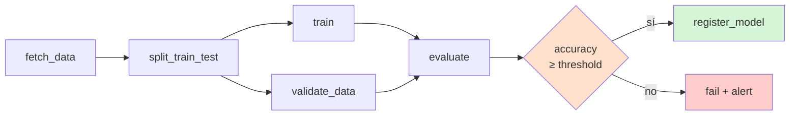
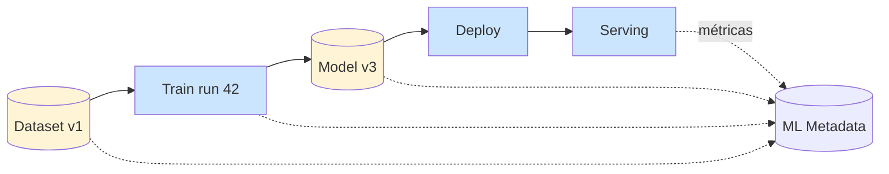
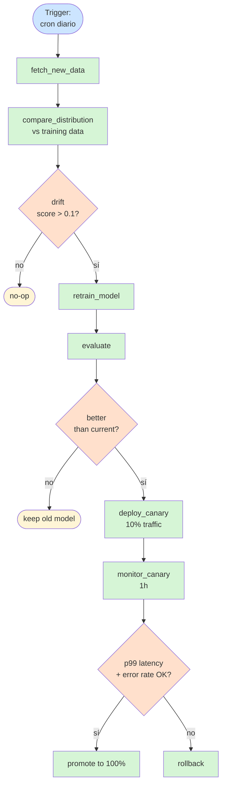
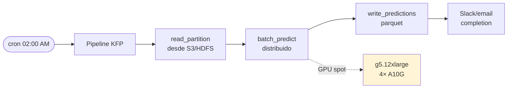
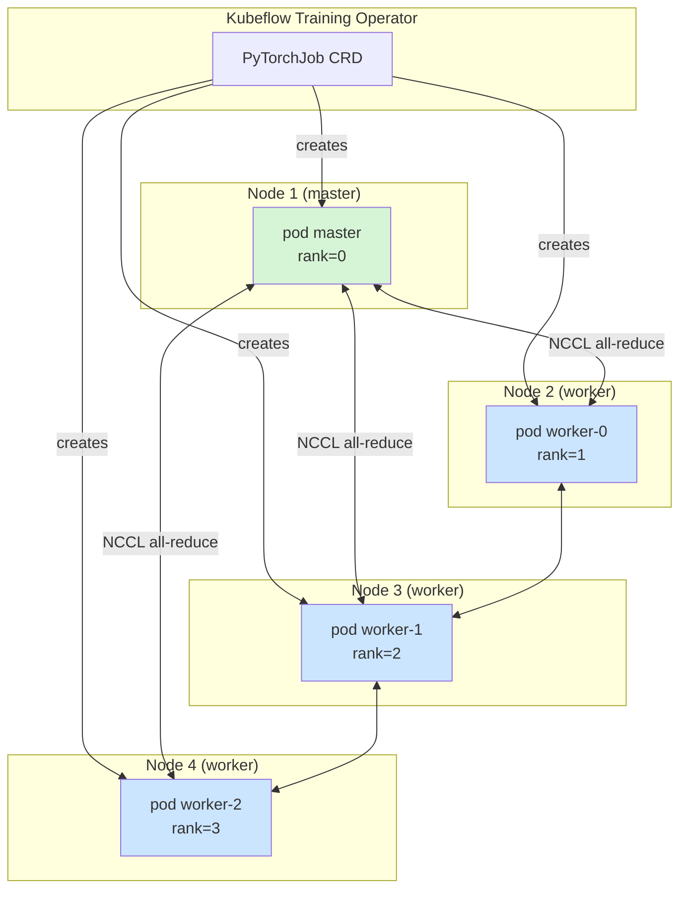

# Patrones de Pipelines MLOps

5 patrones reales que enseñamos en el curso. **Código KFP SDK v2** ejecutable.

## Patrón 1: Training pipeline básico

El "hello world" de MLOps: pipeline que entrena, evalúa, registra.



```python
from kfp import dsl

@dsl.component(packages_to_install=["scikit-learn", "pandas"])
def fetch_data(output_dataset: dsl.Output[dsl.Dataset]):
    import pandas as pd
    from sklearn.datasets import load_iris
    iris = load_iris(as_frame=True)
    df = iris.frame
    df.to_parquet(output_dataset.path)

@dsl.component(packages_to_install=["scikit-learn", "pandas"])
def train(
    dataset: dsl.Input[dsl.Dataset],
    model: dsl.Output[dsl.Model],
) -> float:
    import pandas as pd, joblib
    from sklearn.ensemble import RandomForestClassifier
    df = pd.read_parquet(dataset.path)
    X, y = df.drop("target", axis=1), df["target"]
    clf = RandomForestClassifier(n_estimators=100).fit(X, y)
    joblib.dump(clf, model.path)
    return float(clf.score(X, y))

@dsl.pipeline(name="basic-training")
def pipeline(min_accuracy: float = 0.9):
    data = fetch_data()
    train_step = train(dataset=data.outputs["output_dataset"])
    with dsl.If(train_step.output >= min_accuracy):
        register_model(model=train_step.outputs["model"])
```

## Patrón 2: Pipeline con artifacts y lineage

Cada output queda registrado en ML Metadata Store con su input lineage.



KFP automáticamente registra:
- **Provenance**: este Model viene de este Dataset y este pipeline run
- **Reproducibility**: hash de imagen + parámetros + código
- **Lineage queries**: "qué modelos usaron Dataset v1" → query en MLMD

## Patrón 3: Retraining condicional

Reentrenar **solo cuando** los datos drift o métrica baja:



```python
@dsl.pipeline(name="retraining-pipeline")
def retraining(drift_threshold: float = 0.1):
    new_data = fetch_new_data()
    drift = compare_distribution(
        new_data=new_data.outputs["dataset"],
        baseline=baseline_data,
    )
    with dsl.If(drift.output > drift_threshold):
        new_model = retrain_model(new_data=new_data.outputs["dataset"])
        eval_result = evaluate(model=new_model.outputs["model"])
        with dsl.If(eval_result.output > current_baseline_score):
            deploy_canary(model=new_model.outputs["model"], traffic=0.1)
```

## Patrón 4: Batch inference

No siempre necesitas serving en tiempo real. Para predicciones batch
(scoring nocturno de millones de filas):



```python
@dsl.component(packages_to_install=["pyarrow", "torch"])
def batch_predict(
    input_partition: dsl.Input[dsl.Dataset],
    model: dsl.Input[dsl.Model],
    output_predictions: dsl.Output[dsl.Dataset],
) -> NamedTuple("Stats", [("rows_predicted", int), ("avg_latency_ms", float)]):
    # ... inferencia en batches de 10k filas con GPU
    ...
```

Ventaja vs SageMaker BatchTransform: **mismo código que el training pipeline**,
no API diferente. Reusas componentes.

## Patrón 5: Distributed training con PyTorchJob

Modelos grandes → varias GPUs → varios nodos:



```yaml
apiVersion: kubeflow.org/v1
kind: PyTorchJob
metadata:
  name: distributed-resnet
spec:
  pytorchReplicaSpecs:
    Master:
      replicas: 1
      template:
        spec:
          runtimeClassName: nvidia
          containers:
            - name: pytorch
              image: my-registry/resnet-train:v3
              resources:
                limits: { nvidia.com/gpu: 1 }
    Worker:
      replicas: 3
      template:
        spec:
          runtimeClassName: nvidia
          containers:
            - name: pytorch
              image: my-registry/resnet-train:v3
              resources:
                limits: { nvidia.com/gpu: 1 }
```

Training Operator se encarga de:
- Setear `MASTER_ADDR`, `MASTER_PORT`, `WORLD_SIZE`, `RANK` en cada pod
- Reiniciar workers si crashean (fault tolerance)
- Limpiar al terminar

Sin Training Operator harías esto a mano con StatefulSet + headless service +
script bash de bootstrap. **3-5× más código.**

## Resumen de patrones

| Patrón | Cuándo usarlo | Componente Kubeflow clave |
|---|---|---|
| Training básico | Onboarding, ML clásico | KFP Pipelines |
| Lineage | Compliance, debugging "qué modelo sirvió X cliente" | ML Metadata + KFP |
| Retraining condicional | Producción real, ahorro de cómputo | KFP + dsl.If + Cron |
| Batch inference | Predicciones nocturnas, no real-time | KFP + (opcional) Spark Operator |
| Distributed training | Modelos > 1 GPU | Training Operator (PyTorchJob/TFJob) |

Cada patrón se mapea a 1-2 módulos del curso. Ver [`00-curso-outline.md`](00-curso-outline.md).
