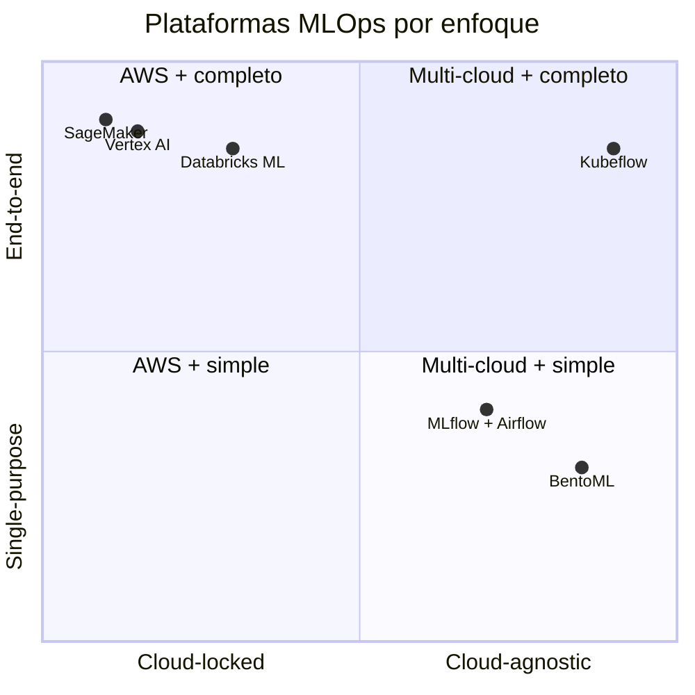
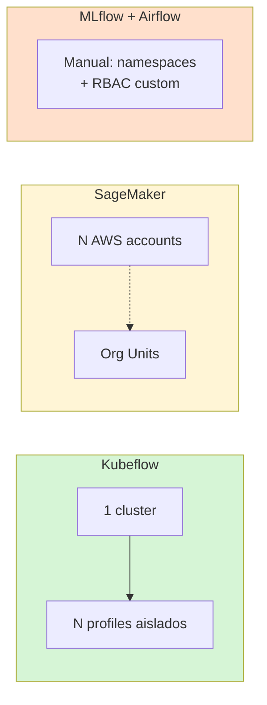
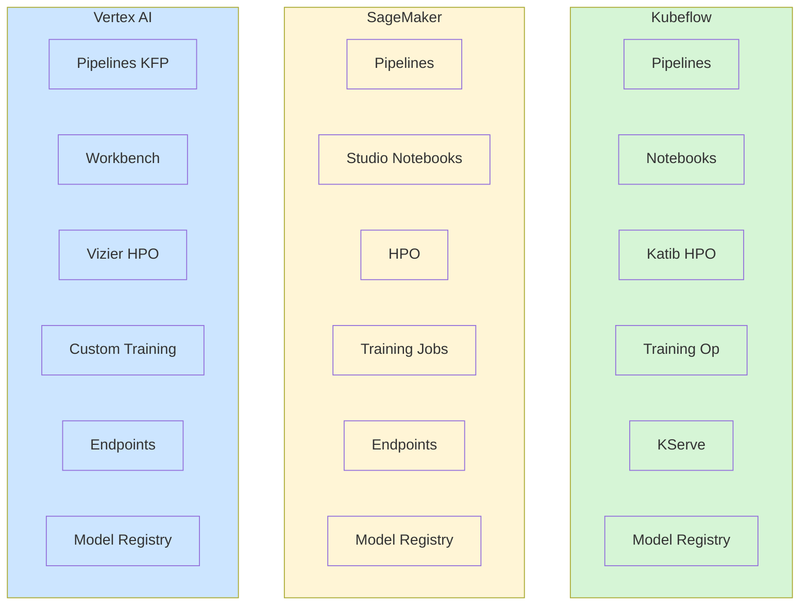

# Kubeflow vs alternativas

Comparativa para decisión arquitectónica. Material para módulo "decisión de stack".

## Resumen ejecutivo



## Comparativa por dimensión

### Reproducibilidad

| Plataforma | Mecanismo | Problema |
|---|---|---|
| **Kubeflow** | `@dsl.component` + ML Metadata | Curva de aprendizaje SDK |
| SageMaker Pipelines | Python SDK + Step | Lock-in AWS |
| Vertex AI Pipelines | KFP DSL (compatible) | Lock-in GCP, pero código portable a Kubeflow |
| MLflow + Airflow | `mlflow.log_*()` manual | Sin lineage automático entre runs |
| Databricks | MLflow nativo | Lock-in plataforma |

### Multi-tenancy



Kubeflow gana en cluster compartido (50 data scientists, 1 cluster). SageMaker
pide más cuentas AWS, MLflow no maneja multi-tenancy bien.

### Costos

| Componente | Kubeflow | SageMaker | Vertex AI |
|---|---|---|---|
| Software | gratis (open-source) | incluido en uso | incluido en uso |
| Compute | tu factura (EC2/GPUs) | EC2 + premium ~30% | GCE + premium ~30% |
| Storage | S3/GCS/HDFS/Longhorn | S3 forzado | GCS forzado |
| Lock-in | bajo | alto | alto |
| Operator overhead | tienes que mantener cluster | nada | nada |

**Trade-off:** Kubeflow es ~30% más barato si ya tienes equipo Kubernetes,
pero ese equipo cuesta. Para empresa pequeña, SageMaker es más rápido onboarding.

### Stack completo



Los 3 cubren el ciclo completo. Las diferencias son:
- **Kubeflow** = open standards, multi-cloud, autohostas
- **SageMaker** = managed, lock-in AWS, opinionado
- **Vertex AI** = managed, lock-in GCP, **usa KFP DSL** (mejor portabilidad que SageMaker)

## Decisión por contexto

```mermaid
flowchart TD
    START[¿Qué situación?]
    START --> Q1{¿Multi-cloud<br/>o on-prem?}
    Q1 -- "Sí" --> KUBEFLOW[Kubeflow]
    Q1 -- "No, AWS only" --> Q2{¿Equipo<br/>Kubernetes-ready?}
    Q2 -- "Sí" --> KUBEFLOW
    Q2 -- "No" --> SM[SageMaker]
    Q1 -- "No, GCP only" --> VERTEX[Vertex AI<br/>+ KFP code portable]

    START --> Q3{¿Solo serving?<br/>(no pipelines)}
    Q3 -- "Sí" --> BENTO[BentoML / Triton / vLLM]

    START --> Q4{¿Equipo de 2-3<br/>sin K8s?}
    Q4 -- "Sí" --> ML_AIR[MLflow + Airflow]

    classDef recommend fill:#d6f5d6
    class KUBEFLOW,SM,VERTEX,BENTO,ML_AIR recommend
```

## Migración entre stacks

| De → A | Esfuerzo | Notas |
|---|---|---|
| **MLflow → Kubeflow** | medio | Reescribir runs como `@dsl.component` |
| **Airflow → KFP** | bajo | Mismas DAGs, diferente DSL |
| **Vertex AI → Kubeflow** | bajo | Mismo SDK KFP, cambiar `Client(host=...)` |
| **SageMaker → Kubeflow** | alto | Reescribir Pipelines, Endpoints, Studio |
| **Kubeflow → SageMaker** | alto | Lock-in implica costo de migración |

**Lección de oro para curso:** Vertex AI tomó la decisión correcta de adoptar
KFP. Si Google migrara a Kubeflow, la transición sería ~día de trabajo. Si AWS
hiciera lo mismo con SageMaker → Kubeflow, semanas.

## Referencias

- [Kubeflow vs MLflow](https://valohai.com/blog/kubeflow-vs-mlflow/)
- [SageMaker vs Kubeflow](https://www.run.ai/guides/machine-learning-engineering/kubeflow-vs-sagemaker)
- [Vertex AI Pipelines = KFP](https://cloud.google.com/vertex-ai/docs/pipelines/introduction)
