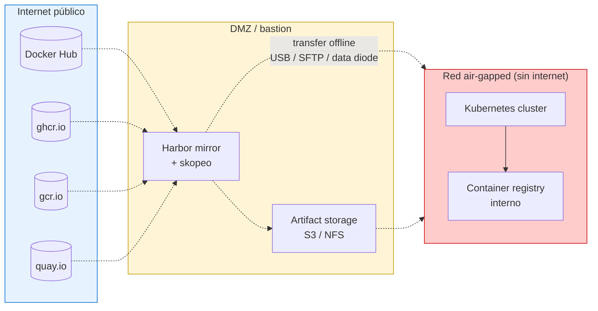
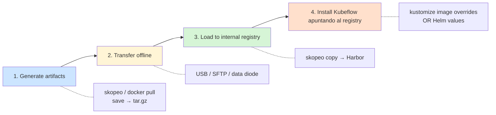
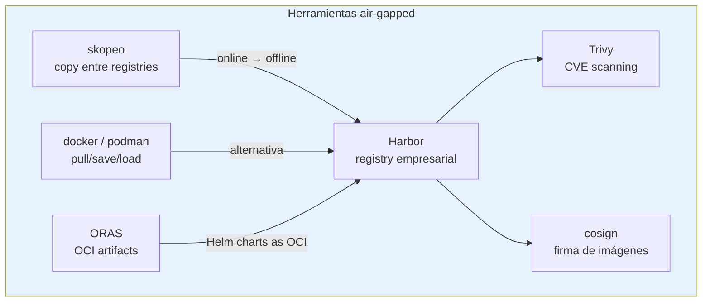
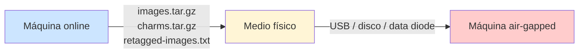
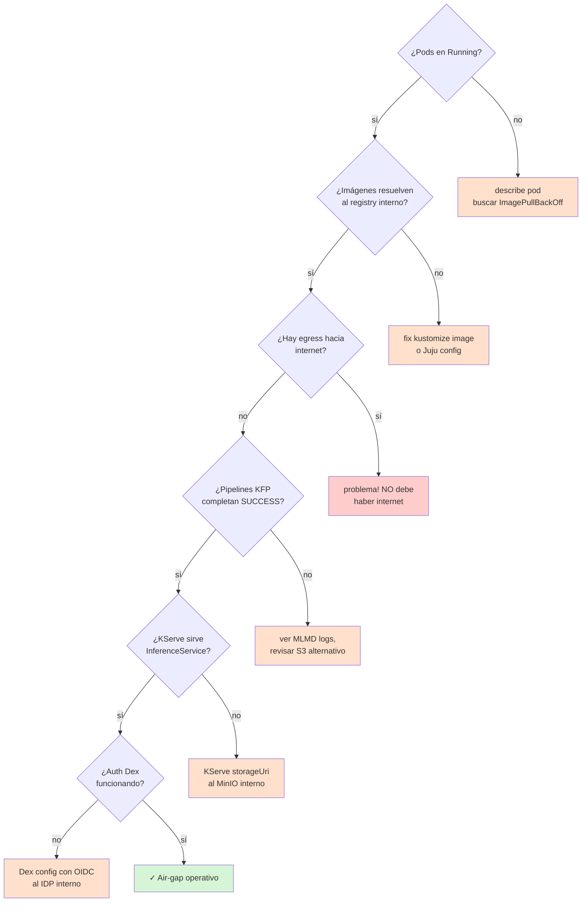

# Air-Gapped Kubeflow Install — Patrón general + ejemplo Charmed Kubeflow

> **Módulo 13 del curso.** Cómo instalar Kubeflow en entornos sin internet:
> bancos, gobierno, salud, defensa, manufacturing OT, plantas industriales.

## ¿Por qué air-gapped?



**Casos de uso reales:**

| Sector | Ejemplo |
|---|---|
| **Banca** | Modelos antifraude on-prem, datos no salen del datacenter |
| **Gobierno** | Defensa, inteligencia, plataformas con clasificación |
| **Salud** | HIPAA strict mode, datos de pacientes nunca tocan cloud |
| **Industrial / OT** | Plantas con red OT separada, modelos de mantenimiento predictivo |
| **Soberanía digital** | Países con leyes de residencia de datos (Rusia, China, UE post-Schrems II) |

## Patrón general (4 fases)



Independiente de la distribución (Kubeflow manifests, Charmed Kubeflow, deployKF),
todas siguen este patrón. Cambian las herramientas, no el flujo.

## Tres opciones para tu curso

| Opción | Pros | Contras |
|---|---|---|
| **Manifests + kustomize image overrides** | Control total, vendor-neutral | Trabajo manual de mirror para ~80 imágenes |
| **Charmed Kubeflow (Canonical)** | Helper scripts oficiales, Juju operators | Lock-in a Juju + Canonical |
| **deployKF** | Optimizado air-gapped, `<tool>.images` overrides | Comunidad pequeña |

Para tu curso recomiendo **enseñar las 3** y dejar que el alumno elija según su empresa.

## Toolkit estándar



| Herramienta | Para qué | Por qué importa |
|---|---|---|
| **skopeo** | `skopeo copy docker://src docker://dst` | No requiere docker daemon, paraleliza, mantiene metadata |
| **Harbor** | Registry empresarial con UI, RBAC, scanning | Es el "GitHub para imágenes" de tu cluster |
| **Trivy** | Scan de CVEs en imágenes mirroreadas | Compliance: nada entra al air-gap sin scan |
| **cosign** | Sigmstore signatures | Cadena de confianza: ¿esta imagen es la oficial? |
| **ORAS** | Push Helm charts y artifacts genéricos a Harbor | Charts también pueden vivir en Harbor (no GitHub) |

## Ejemplo concreto: Charmed Kubeflow (CKF) air-gapped

Charmed Kubeflow es la distribución oficial de Canonical. Trae **scripts helper**
para air-gapped — es el camino más rápido si no quieres hacer tú el tooling.

### Fase 1: Generar artefactos (en máquina con internet)

```bash
# Clonar bundle
git clone https://github.com/canonical/bundle-kubeflow.git
cd bundle-kubeflow/scripts/airgapped

# Pre-requisitos
pip3 install -r requirements.txt
sudo apt install pigz
sudo snap install docker yq jq

# Listar todas las imágenes del bundle CKF (ej: 1.8 stable)
./scripts/airgapped/get-all-images.sh \
  releases/1.8/stable/kubeflow/bundle.yaml > images.txt

# Pull al cache local
python3 scripts/airgapped/save-images-to-cache.py images.txt

# Re-tag con dominio del registry interno
python3 scripts/airgapped/retag-images-to-cache.py \
  --new-registry=harbor.airgap.local images.txt

# Empaquetar a tar.gz
python3 scripts/airgapped/save-images-to-tar.py retagged-images.txt
# → genera images.tar.gz (~10-20 GB)

# Empaquetar charms (Juju operators)
BUNDLE_PATH=releases/1.8/stable/kubeflow/bundle.yaml
python3 scripts/airgapped/save-charms-to-tar.py $BUNDLE_PATH
# → genera charms.tar.gz
```

### Fase 2: Transfer offline



Para entornos con compliance fuerte, el transfer pasa por una **DMZ con scanning**
(antivirus + Trivy + integrity check) antes de tocar el air-gap.

### Fase 3: Cargar al registry interno

```bash
# En la máquina air-gapped
mkdir charms images
tar -xzvf charms.tar.gz --directory charms
tar -xzvf images.tar.gz --directory images

# Cargar imágenes al docker daemon local
for img in images/*.tar; do
  docker load < $img
done

# Push al registry interno (Harbor)
python3 scripts/airgapped/push-images-to-registry.py retagged-images.txt

# Importar también las imágenes base de Juju (charms)
docker pull docker.io/jujusolutions/charm-base:ubuntu-20.04
docker pull docker.io/jujusolutions/charm-base:ubuntu-22.04
docker tag docker.io/jujusolutions/charm-base:ubuntu-20.04 \
  harbor.airgap.local/jujusolutions/charm-base:ubuntu-20.04
docker push harbor.airgap.local/jujusolutions/charm-base:ubuntu-20.04
# (idem para 22.04)
```

### Fase 4: Deploy CKF

```bash
# Setup Juju en air-gapped (ver docs Juju)
juju bootstrap microk8s
juju add-model kubeflow

# Ejecutar el script de deploy
bash deploy-1.8.sh
```

### Configuración de gateway (importante)

Si el cluster no tiene LoadBalancer (típico on-prem con MetalLB no instalado),
cambia el service type:

```bash
# En deploy-1.8.sh, cambia:
juju deploy --trust ./$(charm istio-gateway) istio-ingressgateway \
  --config kind=ingress \
  --config proxy-image=$(img istio/proxyv2) \
  --config gateway_service_type="NodePort"   # ← agregar esto
```

## Alternativa: manifests crudos + skopeo + kustomize

Si no quieres lock-in con Canonical/Juju:

### Listar imágenes de Kubeflow manifests

```bash
git clone -b v1.10.2 https://github.com/kubeflow/manifests.git
cd manifests
kubectl kustomize example | grep "image:" | sort -u | sed 's/.*image: //' > images.txt
# → ~80 imágenes
```

### Mirror con skopeo

```bash
REGISTRY=harbor.airgap.local
while read img; do
  src="docker://$img"
  dst="docker://$REGISTRY/${img#*/}"  # remueve dominio source
  echo "skopeo copy $src $dst"
  skopeo copy --multi-arch=all --src-tls-verify=true --dest-tls-verify=true \
    "$src" "$dst"
done < images.txt
```

### Reescribir manifests con kustomize image overrides

```yaml
# kustomization.yaml (overlay air-gapped)
apiVersion: kustomize.config.k8s.io/v1beta1
kind: Kustomization
resources:
  - ../../example
images:
  - name: docker.io/istio/proxyv2
    newName: harbor.airgap.local/istio/proxyv2
    newTag: 1.22.1
  - name: gcr.io/ml-pipeline/api-server
    newName: harbor.airgap.local/ml-pipeline/api-server
    newTag: 2.5.0
  # ... resto de imágenes
```

```bash
kubectl kustomize . | kubectl apply --server-side -f -
```

## Verificación post-install

Checklist que entregamos a alumnos:



## Hallazgos comunes (troubleshooting)

| Síntoma | Causa probable | Solución |
|---|---|---|
| `ImagePullBackOff` con DNS error | Cluster tiene DNS público hardcoded | Apuntar CoreDNS al DNS interno |
| `x509: certificate signed by unknown authority` | Registry con cert self-signed no confiado | Importar cert al containerd `/etc/containerd/certs.d/` |
| Pipelines fallan al subir artifacts | MinIO/S3 tiene endpoint externo | Configurar KFP `pipelineRoot: minio.internal` |
| Helm install cuelga | `helm` intenta resolver `helm.sh` (Hub público) | Usar OCI charts: `helm install oci://harbor/charts/...` |
| KServe no encuentra modelo | `storageUri` apunta a S3 público | Re-publicar modelo a MinIO/S3 interno |

## Reglas de oro para producción air-gapped

`★ ───────────────────────────────────────────────`
1. **Mirror todo**, no solo Kubeflow. Imágenes base (Ubuntu, alpine), Helm
   charts, modelos pre-entrenados, datasets de fine-tuning.
2. **Versiona el mirror**. Una imagen "latest" en el espejo no es la misma que
   "latest" upstream — reproducibilidad necesita tags fijos.
3. **Scan en CI**. Trivy + cosign verify ANTES de publicar a Harbor producción.
4. **Plan de actualización**. Cada release de Kubeflow trae imágenes nuevas →
   proceso recurrente de mirror, no one-shot.
5. **Caché de pip/conda interno**. Si tus pipelines hacen `pip install` en
   componentes, necesitas un PyPI mirror (devpi, Artifactory).
6. **Document network egress = 0**. Auditar con Falco o Cilium NetworkPolicy
   en `default deny`.
`─────────────────────────────────────────────────`

## Material para el curso

Lo que entregamos a alumnos en este módulo:

- Script `mirror.sh` que hace `skopeo copy` para todas las imágenes Kubeflow
  v1.10.2 (~80) al Harbor del lab.
- `kustomization.yaml` overlay con todos los image overrides ya listos.
- `docker-compose.yml` para correr Harbor + Trivy + cosign localmente como
  simulación del air-gap.
- Checklist de verificación post-install en formato Markdown.
- Demo en vivo: tomar un pipeline KFP, identificar las imágenes que necesita,
  mirrorearlas, ejecutar offline.

## Referencias

- [Charmed Kubeflow — air-gapped install](https://charmed-kubeflow.io/docs/install-airgapped) — fuente de este doc
- [Kubeflow Manifests](https://github.com/kubeflow/manifests) — instalación vendor-neutral
- [deployKF — Air-gapped Clusters and Private Registries](https://www.deploykf.org/guides/platform/offline/)
- [Harbor docs](https://goharbor.io/docs/)
- [skopeo](https://github.com/containers/skopeo)
- [HPE Ezmeral — Kubeflow in an Air-Gapped Environment](https://docs.ezmeral.hpe.com/runtime-enterprise/52/reference/kubernetes/kubernetes-administrator/kubeflow/Kubeflow_in_an_AirGapped_Environment.html)
- [Mirroring images for offline K8s clusters](https://oneuptime.com/blog/post/2026-01-19-kubernetes-mirror-images-offline/view)
