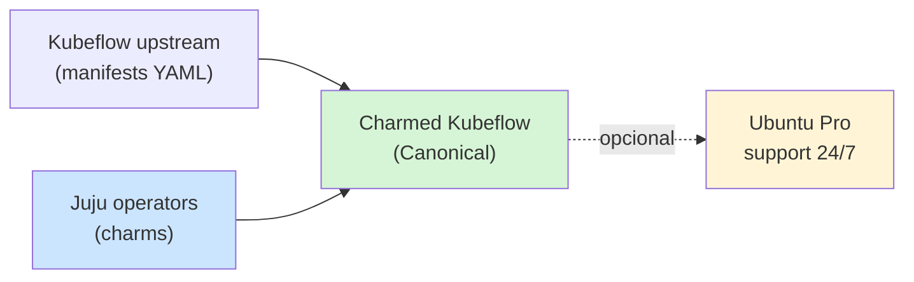
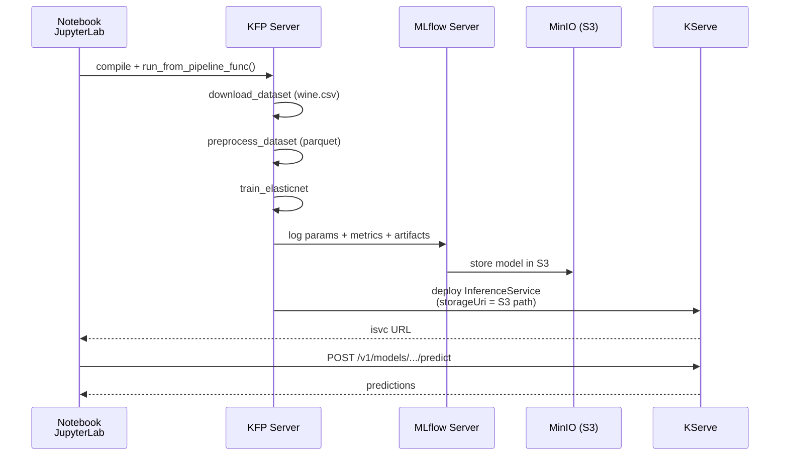

# Charmed Kubeflow (Canonical) — distribución oficial Ubuntu/Juju

> **Módulo opcional del curso** — una de las 3 formas de instalar Kubeflow on-prem.
> Comparada con manifests crudos y deployKF.

## ¿Qué es Charmed Kubeflow (CKF)?



**CKF** envuelve cada componente de Kubeflow en un **charm de Juju**. Esto trae:

- Lifecycle management declarativo (`juju deploy`, `juju upgrade`, `juju remove`)
- Día-2 ops automáticos (TLS rotation, backup hooks, scaling)
- Soporte comercial Canonical (opcional)
- Integración con Ubuntu Advantage / Pro

A cambio: **lock-in a Juju** (no es kustomize, no es Helm, es otro paradigma).

## Cuándo elegir CKF

| Situación | CKF | Manifests | deployKF |
|---|---|---|---|
| Cliente Canonical / Ubuntu Pro | ✅ | — | — |
| Quieres soporte 24/7 | ✅ | — | — |
| Equipo familiarizado con Juju | ✅ | — | — |
| Quieres control total YAML | — | ✅ | — |
| Prioridad: simplicity de install | — | — | ✅ |
| Air-gapped sin internet | ✅ (scripts oficiales) | medio | ✅ |
| Curso vendor-neutral | — | ✅ | medio |

## Tutorial wine-quality end-to-end (en CKF real)

Este es el ejemplo oficial de Canonical. **Asume CKF + MLflow + KServe ya
deployados**. Para el lab local nuestro lo adaptamos en
[`../models/04_wine_kfp_mlflow.py`](../models/04_wine_kfp_mlflow.py) sin necesitar CKF.

### Setup CKF (cuando llegue el momento)

```bash
# Pre-requisitos (en máquina con Ubuntu 22.04 + 32 GB RAM mínimo)
sudo snap install microk8s --classic --channel 1.31/stable
sudo microk8s enable dns hostpath-storage ingress metallb:10.64.140.43-10.64.140.49
sudo microk8s enable rbac

# Juju + CKF
sudo snap install juju --channel 3.5/stable
juju bootstrap microk8s
juju add-model kubeflow

juju deploy kubeflow --trust --channel 1.10/stable
juju deploy mlflow --trust --channel latest/stable
juju integrate mlflow kubeflow-dashboard
juju config dex-auth public-url=http://10.64.140.43.nip.io
```

Tiempo: ~30-45 min con todas las imágenes pulled. Recursos: ~16 GB RAM, 8+ cores.

### Pipeline wine-quality según Canonical



### Componentes que define (resumen del tutorial Canonical)

```python
# 1. Download dataset
@component(packages_to_install=["requests==2.32.5", "pandas==2.3.3"])
def download_dataset(url: str, dataset_path: OutputPath('Dataset')): ...

# 2. Preprocess
@component(packages_to_install=["pandas==2.3.3", "pyarrow==19.0.1"])
def preprocess_dataset(dataset: InputPath('Dataset'), output_file: OutputPath('Dataset')): ...

# 3. Train + log a MLflow
@component(packages_to_install=["scikit-learn==1.8.0", "mlflow==2.22.4", "boto3==1.42.37"])
def train_model(dataset: InputPath('Dataset'), run_name: str, model_name: str) -> str:
    mlflow.sklearn.autolog()
    with mlflow.start_run(run_name=run_name):
        lr = ElasticNet(alpha=0.5, l1_ratio=0.5).fit(train_x, train_y)
        mlflow.sklearn.log_model(lr, "model", registered_model_name=model_name)
        return f"{run.info.artifact_uri}/model"

# 4. Deploy a KServe
@component(packages_to_install=["kserve==0.15.2"])
def deploy_model_with_kserve(model_uri: str, isvc_name: str) -> str:
    isvc = V1beta1InferenceService(
        spec=V1beta1InferenceServiceSpec(
            predictor=V1beta1PredictorSpec(
                service_account_name="kserve-controller-s3",
                sklearn=V1beta1SKLearnSpec(storage_uri=model_uri),
            )
        )
    )
    KServeClient().create(isvc)
    return isvc_url
```

### Inferencia HTTP

```python
import requests
input_data = {
    "instances": [
        [7.4, 0.7, 0.0, 1.9, 0.076, 11.0, 34.0, 0.9978, 3.51, 0.56, 9.4],
        [7.8, 0.88, 0.0, 2.6, 0.098, 25.0, 67.0, 0.9968, 3.2, 0.68, 9.8]
    ]
}
response = requests.post(f"{isvc_url}/v1/models/{ISVC_NAME}:predict", json=input_data)
print(response.text)  # → {"predictions": [5.5, 5.3]}
```

## Diferencias vs nuestro lab local

| Capacidad | CKF (real) | Lab local (`models/04_*.py`) |
|---|---|---|
| KFP server | ✅ con UI | ❌ `kfp.local` (CLI only) |
| MLflow server con UI | ✅ Charmed MLflow | sqlite local opcional |
| KServe inference | ✅ ISVC con HTTP endpoint | ❌ skipeado (requiere cluster) |
| MinIO S3 | ✅ Charmed MinIO | filesystem local |
| Multi-tenant (Profiles) | ✅ Dex + RBAC | N/A single-user |
| Auto-restart en falla | ✅ Juju lifecycle | manual |
| Recursos | 16+ GB RAM | 1 GB RAM |
| Setup time | ~45 min | ~5 min |

## Para tu daily de mañana

Tienes **dos demos** del mismo ejemplo:

1. **Local funcional hoy** → `python models/04_wine_kfp_mlflow.py`
   - Pipeline completo end-to-end (download → preprocess → train → eval)
   - MLflow tracking opcional con sqlite
   - Sin KServe (skipped, requiere cluster)
   - Output: ElasticNet entrenado, métricas (MSE, MAE, R²)

2. **CKF en EKS / on-prem real** → este doc como roadmap
   - Setup completo de CKF con scripts mostrados arriba
   - Pipeline idéntica (cambio `kfp.local` → `kfp.Client(host=...)`)
   - + KServe deployment
   - + MLflow UI navegable
   - + JupyterLab para iterar

## Referencias oficiales

- [Charmed Kubeflow Tutorials — Build your first ML model](https://charmed-kubeflow.io/docs/build-your-first-ml-model) — fuente de este doc
- [CKF docs index](https://charmed-kubeflow.io/docs)
- [Juju documentation](https://juju.is/docs/juju)
- [Charmed MLflow](https://charmed-kubeflow.io/docs/mlflow)
- [KServe](https://kserve.github.io/website/)
